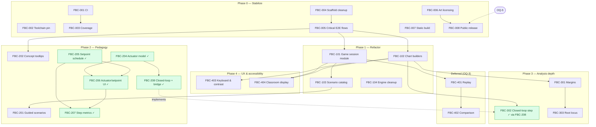

# Improvement Plan — Flappy Bird Control Lab

> **Plan of record.** This document supersedes the roadmap in
> `docs/SOFTWARE_DESIGN_PLAN.md` (Phases 0–6 there are all delivered; that file remains
> the authoritative _design_ reference). Agents: read
> [Part 2 — How to use this document](#how-to-use-this-document) before picking up work.

**Audit date:** 2026-07-03 · **Audited commit:** `a49e858` · **Owner:** Roger Olsson

### Current status (updated 2026-07-11)

**Done since the audit:** FBC-204…208 — the regulator-visibility work (owner direction
2026-07-11): a shared actuator model with selectable `arcade` / `lab` modes, a
deterministic setpoint step schedule, step-response and saturation metrics, and the
closed-loop step-response view with its theory-vs-game explainer (which also completed
FBC-302). Part 1's audit verdict below is a snapshot of 2026-07-03 and has **not** been
re-run; per-item Status fields in Part 2 are authoritative.

**Next item by the selection rule:** FBC-001 (CI pipeline) — the highest-value remaining
gap, since the quality gate is still enforced only by convention. Phase 0 items FBC-001…
FBC-005 all remain `Todo`.

---

## Part 1 — Executive Summary

### Audit verdict

**Strengths.** The core of this project is in genuinely good shape. The simulation is
deterministic by construction (seeded mulberry32 RNG, fixed-Δt sub-stepping, no wall-clock
reads inside the physics loop), the math lives in pure, well-tested modules, and the game
and analysis views share a single physics model as the design mandates. TypeScript strict
mode is clean (0 errors across 807 files), lint is clean, and all 232 unit tests pass. The
build succeeds in under 4 seconds. All seven phases of the original roadmap are delivered:
manual play, three controller families (On-Off, PID, transfer-function with Tustin
discretization), the full analysis view (step response, Bode, pole-zero), telemetry
metrics (ISE/IAE/ITAE, settling time), presets, disturbance injection, run history, and a
sprite-based texture pass. The agent-facing documentation (AGENTS.md, `.claude/` skills
and roles) is unusually thorough.

**Blockers.** The safety net the documentation promises does not exist. There is **no CI
at all** — no `.github/` directory — despite AGENTS.md declaring "Playwright E2E suite
must pass on every PR." Coverage targets (≥ 90% for `control/` and `analysis/`) are
labelled "enforced," but no coverage tooling is installed, so nothing enforces them. The
E2E suite is a single placeholder test (asserts an `<h1>` is visible); none of the four
critical flows named in `docs/TEST_GUARDRAILS.md` are covered, and the S1–S5 scenario
catalog was never built. The two route pages are the weakest code in the repo:
`src/routes/analysis/+page.svelte` (892 lines at audit; ~1250 after FBC-208) and
`src/routes/game/+page.svelte` (728 lines at audit; ~1025 after FBC-206) contain the
game loop, controller orchestration, and chart construction inline, where unit tests
cannot reach them. Documentation had drifted: a stale `Agents.md`
contradicted `AGENTS.md` about which file was canonical (fixed in the same commit that
adds this plan). Finally, `static/sprites/` contains the original copyrighted Flappy Bird
art (.GEARS Studio) — acceptable for private classroom use, a legal risk if the repo or a
deployment is public — and there is no deployment story (`adapter-auto` with no target).

### Product direction

Decisions below were **confirmed by the owner on 2026-07-04** (except where noted).
One residual tension from those answers is logged as OQ-5 in Part 2.

| Topic           | Direction (decided)                                                                                                                       | Status                                  | Ref  |
| --------------- | ----------------------------------------------------------------------------------------------------------------------------------------- | --------------------------------------- | ---- |
| Audience        | BSc students in an introductory control course; instructor-driven classroom use                                                           | Inferred from docs                      | —    |
| Business model  | Free educational tool; no monetization                                                                                                    | Inferred from docs                      | —    |
| Stack           | Keep SvelteKit + TypeScript + Three.js; no migration                                                                                      | Confirmed by audit                      | —    |
| Deployment      | No hosted deployment. Public GitHub repo; students clone and serve the static build themselves with a Python webserver (current practice) | Confirmed 2026-07-04 (revised same day) | OQ-1 |
| Data strategy   | localStorage only for now — no backend, no file export; a class leaderboard is possible future scope and would introduce a backend then   | Confirmed 2026-07-04                    | OQ-2 |
| Next capability | Pedagogy & curriculum → analysis depth → UX & accessibility; replay tooling deferred                                                      | Confirmed 2026-07-04                    | OQ-3 |
| Game art        | Keep the .GEARS sprites; private classroom use accepted — but see OQ-5 re making the repo public                                          | Confirmed 2026-07-04                    | OQ-4 |

### Recommended stack additions

| Addition                               | Why (one line)                                                                                                                    |
| -------------------------------------- | --------------------------------------------------------------------------------------------------------------------------------- |
| GitHub Actions workflow                | The only missing piece between "quality gate documented" and "quality gate enforced."                                             |
| `@vitest/coverage-v8` + thresholds     | AGENTS.md already mandates coverage floors; this makes them real.                                                                 |
| `engines` field + `.nvmrc`             | Pins Node/npm so agents, CI, and humans run the same toolchain.                                                                   |
| `@sveltejs/adapter-static`             | The app is fully client-side; static output lets students serve it with any plain webserver, e.g. `python -m http.server` (OQ-1). |
| _Deliberately omitted:_ error tracking | Client-side classroom app with no backend; CI + E2E is the right-sized safety net.                                                |

### The plan in one paragraph

Phase 0 stabilizes: add CI that runs the existing quality gate on every PR, pin the
toolchain, install coverage enforcement, delete scaffold leftovers, and replace the
placeholder E2E test with the four documented critical flows — so the safety net exists
before anything moves. Phase 1 pays down the main architectural debt behind that net:
extract the game-session orchestration and analysis chart builders out of the two
oversized route pages into testable library modules, then encode the S1–S5 scenario
catalog as seeded integration tests. Phases 2–4 then add capability in the order the
owner confirmed — pedagogy (guided scenarios, concept explanations, and the delivered
actuator/step-response work of FBC-204…208), analysis depth (stability margins,
closed-loop step response — delivered by FBC-208 — and root locus), and UX & accessibility
(keyboard/contrast, projector-friendly classroom display). Replay/comparison tooling is
deferred and run export is dropped (localStorage-only decision, with a class leaderboard
as possible future scope). There is no hosted deployment: the static build is served by
students with their own Python webserver, and the repo is intended to become public —
which leaves one caveat (OQ-5): the copyrighted sprites accepted for private classroom
use cannot be redistributed in a public repo, so publication (FBC-008) waits on that
resolution.

---

## Part 2 — Agent-Ready Backlog

### How to use this document

1. **Pick the lowest-numbered item with `Status: Todo` whose `Depends-on` items are all
   `Done`.** Items marked `Blocked` wait on an open question (OQ-x) — skip them and do
   not start them until the owner has answered.
2. **Work the item within its stated Scope.** Do not bundle neighbouring items into one
   change; one item = one PR-sized change.
3. **Pass the verification gate before marking anything done.** Every item's gate includes
   `npm run qa` (check + lint + unit + e2e) green, plus any item-specific criteria listed
   under Acceptance. Never weaken a test to get green (see AGENTS.md).
4. **Update this file in the same commit** that completes the item: set `Status: Done`,
   and add a one-line completion note (date + commit subject) under the item.
5. **If you discover new work,** add a new item with the next free ID in the matching
   phase — never renumber or reuse IDs.

Status values: `Todo` · `In progress` · `Blocked` · `Done` · `Deferred` (owner
deprioritized; do not pick up) · `Dropped` (owner decided against; kept for the record).
Priority values: `P0` (do first) · `P1` (next) · `P2` (nice to have).

---

### Phase 0 — Stabilize (safety net before features)

#### FBC-001 — Add CI pipeline (GitHub Actions)

- **Status:** Todo · **Priority:** P0 · **Depends-on:** —
- **Problem:** No CI exists (`.github/` is absent), so the documented rule "Playwright
  E2E must pass on every PR" is unenforced; regressions land silently.
- **Scope:** Add `.github/workflows/ci.yml` running on PRs and pushes to `main`:
  install deps (with npm cache), `npx playwright install --with-deps chromium`, then
  `npm run check`, `npm run lint`, `npm run test:unit -- --run`, `npm run test:e2e`,
  `npm run build`. Upload the Playwright report as an artifact on failure.
- **Acceptance:** Workflow is green on a PR from a clean checkout; a deliberately
  broken test on a scratch branch turns it red. Gate: `npm run qa` locally + CI green.

#### FBC-002 — Pin the toolchain

- **Status:** Todo · **Priority:** P0 · **Depends-on:** —
- **Problem:** No Node version is pinned anywhere; agents, CI, and humans can drift.
  (The audit itself hit a Playwright-browser/version mismatch in a fresh environment.)
- **Scope:** Add `engines` to `package.json` (Node LTS), add `.nvmrc`, and note the
  pinned versions in AGENTS.md's setup section. Do not change any script.
- **Acceptance:** `npm install` warns/fails on wrong Node major (engine-strict
  documented); CI (FBC-001, if present) uses the pinned version. Gate: `npm run qa`.

#### FBC-003 — Enforce coverage thresholds

- **Status:** Todo · **Priority:** P0 · **Depends-on:** FBC-001
- **Problem:** AGENTS.md calls coverage targets "enforced" (≥ 90% control/analysis,
  ≥ 85% game core, ≥ 75% UI utilities) but no coverage tooling is installed.
- **Scope:** Add `@vitest/coverage-v8`; configure per-directory thresholds in
  `vite.config.ts` at or slightly below current actuals (measure first — never set a
  threshold above reality to force a scramble); add `npm run test:coverage`; run it in CI.
- **Acceptance:** `npm run test:coverage` reports per-module coverage and fails when a
  threshold is violated; CI runs it. Gate: `npm run qa` + coverage job green.

#### FBC-004 — Remove scaffold leftovers

- **Status:** Todo · **Priority:** P1 · **Depends-on:** —
- **Problem:** `src/demo.spec.ts` (asserts 1 + 2 = 3) and the placeholder naming of
  `e2e/demo.test.ts` are template residue that pads the test count and misleads agents.
- **Scope:** Delete `src/demo.spec.ts`; rename `e2e/demo.test.ts` to `e2e/smoke.test.ts`
  (keep the h1 assertion as a genuine smoke test). Touch nothing else.
- **Acceptance:** Test count drops by exactly one; suite green. Gate: `npm run qa`.

#### FBC-005 — Implement the four documented critical E2E flows

- **Status:** Todo · **Priority:** P0 · **Depends-on:** FBC-004
- **Problem:** `docs/TEST_GUARDRAILS.md §2.3` names four mandatory Playwright flows;
  none exist. Without them, the Phase 1 refactor of the route pages is unprotected.
- **Scope:** Add E2E specs for: (1) manual mode — start, play, game over, score
  persists; (2) each auto mode (On-Off, PID, TF) runs without console errors; (3) an
  analysis-view parameter change applies to auto mode; (4) high-score list survives
  reload. Use deterministic seeds; assert no `NaN` appears in visible telemetry.
- **Acceptance:** All four flows pass headless in CI; flake-free across 3 consecutive
  runs. Gate: `npm run qa`.

#### FBC-006 — Document the game-art licensing constraint

- **Status:** Todo · **Priority:** P1 · **Depends-on:** —
- **Owner decision (2026-07-04, OQ-4):** keep the .GEARS sprites; private classroom use
  accepted.
- **Problem:** `static/sprites/` contains the original copyrighted Flappy Bird sprites
  (.GEARS Studio, via samuelcust/flappy-bird-assets). The accepted risk must be written
  down so no agent or contributor publishes them unknowingly — especially since the
  owner intends the repo to be public (OQ-1 revision), which is exactly the
  redistribution scenario OQ-5 tracks.
- **Scope:** Record the constraint in README and AGENTS.md: sprites are copyrighted,
  private/educational use only; do not make the repo public or serve the sprites from
  any public URL until OQ-5 is resolved; note that `scene-three.ts` retains a
  licensing-clean primitive-geometry fallback.
- **Acceptance:** Constraint documented in README + AGENTS.md with asset provenance.
  Gate: `npm run qa`.

#### FBC-007 — Static build servable by a plain webserver

- **Status:** Todo · **Priority:** P1 · **Depends-on:** —
- **Owner decision (2026-07-04, OQ-1 revised):** no hosted deployment. The repo lives on
  GitHub; students clone it and serve the app themselves with their own webserver — a
  Python-based webserver, as has been the practice so far.
- **Problem:** `adapter-auto` has no detected target and its output is not a plain
  static site, so the current build cannot be served by `python -m http.server`;
  students are forced through the Node dev server.
- **Scope:** Switch to `@sveltejs/adapter-static` with full prerendering (both routes
  emit their own `index.html`; use relative/base-path-safe asset references). Document
  the student workflow in README and `docs/ONBOARDING.md`:
  `npm run build`, then `python -m http.server -d build` (or equivalent). Verify game
  and analysis routes, sprites, and localStorage persistence work when served that way.
- **Acceptance:** `npm run build` output works fully when served by
  `python -m http.server` from the build directory (manual smoke: both routes, one
  auto-mode run, high score persists on reload); workflow documented. Gate:
  `npm run qa`.

#### FBC-008 — Prepare the repository for public release

- **Status:** Blocked (OQ-5) · **Priority:** P1 · **Depends-on:** FBC-006, OQ-5
- **Owner decision (2026-07-04, OQ-1 revised):** the code should live in a public repo
  on the owner's account.
- **Problem:** Making the repo public redistributes the copyrighted .GEARS sprites to
  anyone — beyond the private classroom use accepted in OQ-4. OQ-5 must be resolved
  first (remove/replace the sprites, or the owner explicitly accepts public
  redistribution).
- **Scope:** Per the OQ-5 resolution: swap sprites for free/original assets or ship the
  primitive-geometry renderer as default, audit the repo for anything else unsuitable
  for publication (no secrets found in the audit; re-check), confirm LICENSE covers the
  code, then flip visibility.
- **Acceptance:** OQ-5 resolution recorded here; repo public with no copyrighted assets
  (or explicit owner sign-off documented). Gate: `npm run qa`.

---

### Phase 1 — Refactor for testability (debt paydown behind the net)

#### FBC-101 — Extract game-session orchestration from the game route

- **Status:** Todo · **Priority:** P1 · **Depends-on:** FBC-005
- **Problem:** `src/routes/game/+page.svelte` (728 lines at audit, ~1025 after FBC-206)
  holds the fixed-step loop, controller selection/stepping, telemetry wiring, scoring,
  and run persistence inline — the most behaviour-rich code in the repo with zero unit
  coverage.
- **Scope:** Create `src/lib/game/session.ts` (framework-free class/functions) owning:
  controller-for-mode construction, per-tick controller update + engine stepping,
  telemetry recording, game-over bookkeeping (high score + run summary). The Svelte page
  keeps only rendering, input handling, and store subscriptions. No behaviour change.
- **Acceptance:** Page shrinks below ~300 lines; new module has unit tests covering
  mode switching, a seeded auto-mode run, and game-over persistence; E2E flows
  (FBC-005) still green. Gate: `npm run qa` + coverage not reduced.
- **Carry-over test (from FBC-206):** the extracted loop must be covered by a regression
  test asserting that the controller's sampling period is the fixed Δt regardless of the
  speed multiplier — i.e. a 1× and an 8× run of the same duration produce identical
  trajectories. This defect was fixed in the page but cannot be unit-tested until the
  loop leaves the Svelte component.

#### FBC-102 — Extract analysis chart building from the analysis route

- **Status:** Todo · **Priority:** P1 · **Depends-on:** FBC-005
- **Problem:** `src/routes/analysis/+page.svelte` (892 lines at audit, ~1250 after
  FBC-208) builds SVG chart geometry (step response open- and closed-loop, Bode,
  pole-zero) inline; chart math is untestable and duplicated scaling logic is likely.
- **Scope:** Move point/path/scale computation into pure functions (e.g.
  `src/lib/analysis/chart-data.ts` or `src/lib/ui/charts.ts`); the page maps their
  output to SVG markup. No visual change.
- **Acceptance:** Chart builders unit-tested against known reference data; page under
  ~450 lines; screenshots before/after match. Gate: `npm run qa` + coverage not reduced.

#### FBC-103 — Scenario catalog S1–S5 as seeded integration tests

- **Status:** Todo · **Priority:** P1 · **Depends-on:** FBC-101
- **Problem:** `docs/TEST_GUARDRAILS.md §11` mandates a canonical seeded scenario table
  (S1 baseline, S2 wind burst, S3 narrow gaps, S4 8× speed, S5 aggressive-PID
  overshoot); it was never built.
- **Scope:** Add a fixture module defining the five scenarios (seed, physics/obstacle
  config, controller, disturbance schedule, expected metric bounds) and an integration
  test that runs each headless through `GameEngine` + `session.ts` and asserts the
  metric envelopes and no-NaN invariants.
- **Acceptance:** Five scenarios run deterministically (same metrics across runs);
  documented in TEST_GUARDRAILS. Gate: `npm run qa`.

#### FBC-104 — Engine cleanup: remove dead `nextObstacleX` bookkeeping

- **Status:** Todo · **Priority:** P2 · **Depends-on:** —
- **Problem:** `GameEngine.nextObstacleX` (src/lib/game/engine.ts:63) is written but
  never read; spawn logic actually derives from `rightmostX`. Dead state misleads agents.
- **Scope:** Remove the field and its writes; no behavioural change.
- **Acceptance:** Unit tests unchanged and green. Gate: `npm run qa`.

---

### Phase 2 — Pedagogy & curriculum (recommended next capability)

#### FBC-201 — Guided scenario mode

- **Status:** Todo · **Priority:** P1 · **Depends-on:** FBC-103
- **Problem:** Students face all options at once; the docs call for progressive
  disclosure and guided experiments, and nothing implements it.
- **Scope:** A "Scenarios" panel on the game page that loads an S1–S5 scenario (from the
  FBC-103 fixtures), states the learning goal, runs it, and shows the resulting metrics
  against the expected envelope.
- **Acceptance:** Each scenario playable end-to-end from the UI; E2E test for one
  scenario flow. Gate: `npm run qa`.

#### FBC-202 — Concept explanations and tooltips

- **Status:** Todo · **Priority:** P2 · **Depends-on:** FBC-005
- **Problem:** Analysis views assume vocabulary (Bode, pole-zero, settling time) that a
  first-course student may not have; docs require "strong empty states/tooltips."
- **Scope:** Short, accurate explanations attached to each analysis chart and metric
  (tooltip or collapsible note). Educational text is a correctness surface — the math
  role should review wording.
- **Acceptance:** Every chart and metric has an explanation; a11y: tooltips reachable by
  keyboard. Gate: `npm run qa`.

#### FBC-203 — Export run data for lab reports

- **Status:** Dropped · **Priority:** — · **Depends-on:** —
- **Owner decision (2026-07-04, OQ-2):** data strategy is localStorage only — no backend
  and no file export. Kept for the record; do not implement unless the owner reverses
  the decision here.

#### FBC-204 — Shared actuator model (arcade / lab)

- **Status:** Done · **Priority:** P1 · **Depends-on:** —
- **Owner direction (2026-07-11):** make regulator effects (overshoot, oscillation,
  convergence) clearly visible. Chosen approach: keep Flappy Bird; add a selectable
  "lab" actuator with symmetric thrust about hover so the closed loop matches the
  linear analysis model, and bridge the remaining theory gap in the UI (FBC-205…208).
- **Problem:** The arcade actuator is one-sided (u ∈ [0, 40] N): the controller pushes
  up, only gravity pulls down. The closed-loop response is asymmetric and never matches
  the double-integrator model the analysis views assume, so textbook behaviour is
  invisible in the game.
- **Scope:** `src/lib/game/actuator.ts` — pure actuator model mapping controller output
  to plant thrust. Arcade = total thrust in [0, 40] (bit-identical to before); lab =
  deviation u′ ∈ ±m·g around the exact hover feedforward u_eq = m·g, with plant
  saturation derived from the same numbers so controller clamp and physics clamp can
  never disagree. `spawnObstacles` flag on `GameConfig` (lab runs are obstacle-free
  regulation experiments). Re-exported through `analysis/model.ts`. `physics.ts`
  untouched — lab mode is pure parameterization.
- **Acceptance:** Unit tests prove arcade equals historical constants, lab clamps are
  symmetric and realizable by the one-sided thruster, and `toPlantControl` output always
  lies within plant limits. Gate: `npm run qa`.
- **Completed 2026-07-11** — feat(game): add shared actuator model, setpoint schedule,
  and obstacle-free lab runs.

#### FBC-205 — Deterministic setpoint step schedule

- **Status:** Done · **Priority:** P1 · **Depends-on:** —
- **Problem:** The setpoint was a hardcoded constant (5.0 m), so a live step response —
  the single most instructive stimulus — never occurred during play.
- **Scope:** `src/lib/game/setpoint-schedule.ts` — pure function of simulation time
  (replay-safe): hold 5.0 m for 3 s, then alternate 5.5 / 4.5 m every 6 s. The 1 m steps
  keep the default lab PID inside its ±m·g clamp (Kp·|step| = 8 N < 9.81 N), so the
  response stays essentially linear. Game page offers Constant / Steps sources and
  ↑/↓ keyboard steps (each press is a step input).
- **Acceptance:** Unit tests for boundaries, alternation, determinism, and world-bounds
  containment. Gate: `npm run qa`.
- **Completed 2026-07-11** — feat(game): add shared actuator model, setpoint schedule,
  and obstacle-free lab runs.

#### FBC-206 — Per-actuator controller defaults and game-page wiring

- **Status:** Done · **Priority:** P1 · **Depends-on:** FBC-204, FBC-205
- **Problem:** Controller output clamps were hardcoded to [0, 40] in three places and
  the game page hardcoded the setpoint and effort normalisation, so an actuator mode
  could not be introduced consistently.
- **Scope:** `src/lib/ui/controller-defaults.ts` — controller factory deriving output
  limits from the actuator model (On-Off becomes symmetric ±6 N in lab mode;
  `TFController.getParams()` added so an analysis-applied C(s) is rebuilt with matching
  limits). Game page: Actuator and Setpoint toggles, engine constructed from the
  actuator's plant params, controller output routed through `toPlantControl`, effort
  bars normalised by the actuator scale, presets pinned to arcade.
- **Acceptance:** Unit tests for the factory across both actuator modes; E2E scenario
  runs a lab step schedule end-to-end. Gate: `npm run qa`.
- **Completed 2026-07-11** — feat(ui): wire actuator modes, setpoint sources, and
  step-response reporting into the game view.

#### FBC-207 — Step-response and saturation metrics

- **Status:** Done · **Priority:** P1 · **Depends-on:** FBC-205
- **Problem:** Telemetry had no overshoot, oscillation, or saturation measures — the
  quantities a controls course actually grades — so students could not compare what
  they saw against theory.
- **Scope:** `metrics.ts`: `computeStepResponseMetrics` (per-step overshoot %,
  oscillation half-cycles, classic same-side-peak decay ratio, per-step settling time),
  `summarizeStepMetrics`, `saturationFraction`. Game page: live SATURATED badge +
  %-time-saturated readout, step metrics in the end-of-run report (crash or Stop),
  optional `stepMetrics`/`actuatorMode` on `RunSummary` (old localStorage entries stay
  parseable). Stop now finalizes metrics for auto runs — lab runs have no pipes, so
  Stop is their natural end.
- **Acceptance:** Metrics validated against the analytical 2nd-order step response
  (overshoot and decay ratio for ζ = 0.2 / 0.5 within 1–5%; overdamped → 0%/null).
  Gate: `npm run qa`.
- **Completed 2026-07-11** — feat(telemetry): add step-response and saturation metrics.

#### FBC-208 — Closed-loop step response and theory bridge (implements FBC-302)

- **Status:** Done · **Priority:** P1 · **Depends-on:** FBC-204
- **Problem:** The analysis view only showed the open-loop plant step; nothing showed
  the effect of the tuned controller, and nowhere explained why the game deviates from
  the linear analysis.
- **Scope:** `src/lib/analysis/closed-loop.ts`: `simulateClosedLoop` (exact game path —
  shared `stepPhysics` + actuator model) and `simulateLinearClosedLoop` (the same
  double-integrator model Bode/pole-zero analyse). Analysis page: overlaid game-truth /
  textbook traces with per-trace overshoot, settling, oscillation, and decay-ratio
  readouts, controller and actuator selectors, and a "Why the game differs from the
  textbook" explainer. Game page shows a one-line arcade-vs-theory hint. Landed before
  FBC-102, so chart markup is inline like the existing sections; extraction remains
  FBC-102 scope.
- **Acceptance:** Anti-drift contract test — the closed-loop simulation matches a
  `GameEngine` run step-for-step (|Δy| < 1e-9); linear simulation validated against
  P-only analytic results (100% overshoot, ωₙ period within 2%); lab-mode default-PID
  overshoot inside the linear prediction envelope; arcade gravity bias demonstrated
  (PD steady-state droop = m·g/Kp vs zero in lab; gravity-biased vs centred on-off
  limit cycle). Gate: `npm run qa`.
- **Completed 2026-07-11** — feat(analysis): add closed-loop step response with
  linear-model comparison.

---

### Phase 3 — Analysis depth

#### FBC-301 — Gain and phase margins on the Bode view

- **Status:** Todo · **Priority:** P1 · **Depends-on:** FBC-102
- **Problem:** The Bode plot shows magnitude/phase but not the stability margins that
  make it pedagogically actionable.
- **Scope:** Compute gain margin, phase margin, and crossover frequencies from the
  open-loop response in `src/lib/analysis/bode.ts`; display markers + values on the
  charts. Math role reviews; unit tests against analytical reference systems.
- **Acceptance:** Margins match analytical values for at least two reference systems to
  4 significant figures. Gate: `npm run qa` + coverage floor for `analysis/`.

#### FBC-302 — Closed-loop step response for all controller types

- **Status:** Done (implemented by FBC-208, 2026-07-11 — see Phase 2) · **Priority:**
  P1 · **Depends-on:** FBC-102
- **Problem:** The step-response view is open-loop only; students cannot see the effect
  of their tuned controller on the tracking response — the single most instructive plot.
- **Scope:** Simulate the closed loop (shared physics + active controller) for a
  configurable step; plot alongside the open-loop response; verify consistency with the
  game runtime under the same seed (the anti-drift contract test the design plan asks for).
- **Acceptance:** Closed-loop trace matches a game-runtime run within integration
  tolerance in an automated test. Gate: `npm run qa`.

#### FBC-303 — Root locus view

- **Status:** Todo · **Priority:** P2 · **Depends-on:** FBC-301
- **Problem:** Pole-zero is static; a root locus would show how closed-loop poles move
  with gain — a standard first-course tool.
- **Scope:** Root-locus computation (reuse the Durand–Kerner root finder in
  `pole-zero.ts`) over a gain sweep; SVG plot with stability-boundary cue.
- **Acceptance:** Locus endpoints match open-loop poles/zeros; branch count equals
  system order; reference-system tests. Gate: `npm run qa`.

---

### Phase 4 — UX & accessibility

Confirmed as the third capability priority (OQ-3, 2026-07-04). Items use the next free
IDs in the 4xx block; FBC-401/402 below them are the deferred replay items and keep
their original IDs.

#### FBC-403 — Keyboard and contrast accessibility pass

- **Status:** Todo · **Priority:** P2 · **Depends-on:** FBC-102
- **Problem:** `docs/TEST_GUARDRAILS.md §7` requires keyboard-first operation and
  contrast-compliant charts/overlays; neither has ever been audited or tested.
- **Scope:** Audit both routes for keyboard operability (mode switching, tuning panels,
  preset buttons, disturbance controls) and chart/overlay contrast; fix findings; add an
  automated a11y check (e.g. axe assertions in the E2E suite) for the two pages.
- **Acceptance:** All interactive controls reachable and operable by keyboard; a11y
  check green in CI; chart palettes meet WCAG AA contrast. Gate: `npm run qa`.

#### FBC-404 — Projector-friendly classroom display and progressive disclosure

- **Status:** Todo · **Priority:** P2 · **Depends-on:** FBC-101, FBC-102
- **Problem:** The docs call for legibility "in projector conditions" and progressive
  disclosure to avoid overwhelming students; the current UI shows every control at once
  at laptop-scale sizing.
- **Scope:** A classroom display toggle (larger type, higher contrast, simplified HUD)
  and grouping of advanced controls behind expandable sections; no behaviour change to
  simulation or controllers.
- **Acceptance:** Toggle works on both routes; E2E snapshot of classroom mode; default
  view unchanged. Gate: `npm run qa`.

---

### Deferred — Replay & comparison tooling

Not selected in the owner's 2026-07-04 priority decision (OQ-3). Do not pick these up
until the owner re-prioritizes them; dependencies are kept accurate for that event.

#### FBC-401 — Deterministic run replay

- **Status:** Deferred · **Priority:** P2 · **Depends-on:** FBC-101
- **Problem:** The design promises "replay capability from seed + controller settings";
  run summaries store the ingredients but nothing replays them.
- **Scope:** "Replay" action on a run-history entry: reconstruct engine config, seed,
  and controller snapshot; re-run; assert the score/metrics match the stored summary
  (surfacing any determinism regression to the user).
- **Acceptance:** Replaying a stored run reproduces its score and metrics exactly;
  integration test included. Gate: `npm run qa`.

#### FBC-402 — Side-by-side controller comparison

- **Status:** Deferred · **Priority:** P2 · **Depends-on:** FBC-401
- **Problem:** Comparing controllers currently means playing sequential runs and reading
  a table; the pedagogy wants direct visual comparison under identical disturbances.
- **Scope:** Run two controller configurations headless over the same seed/scenario and
  overlay their altitude/error traces + metric table.
- **Acceptance:** Comparison reproducible for a fixed seed; E2E test of the flow.
  Gate: `npm run qa`.

---

### Dependency graph

_(✓ = Done. Dropped: FBC-203 run export, per OQ-2.)_

### Open questions for the owner

Answered questions stay here as the decision record; **OQ-5 is the only one still open**.
Answering it (edit this section or tell an agent) unblocks FBC-008.

- **OQ-1 — Deployment target.** ✅ **Answered 2026-07-04, revised same day: no hosted
  deployment.** The code lives in a public GitHub repo on the owner's account; students
  clone it and serve the app with their own webserver — a Python-based webserver, as has
  been the practice so far. Implemented by FBC-007 (static build + documented
  `python -m http.server` workflow) and FBC-008 (public release, blocked on OQ-5).
- **OQ-2 — Data strategy.** ✅ **Answered 2026-07-04: localStorage only** — no backend,
  no file export; FBC-203 dropped accordingly. The owner noted a **class leaderboard**
  may be set up later; that would introduce a backend and should enter this backlog as
  new items when the owner schedules it.
- **OQ-3 — Capability ordering.** ✅ **Answered 2026-07-04: pedagogy & curriculum,
  analysis depth, and UX & accessibility** (in that phase order). Replay & comparison
  tooling not selected → FBC-401/402 deferred.
- **OQ-4 — Game-art licensing.** ✅ **Answered 2026-07-04: keep the sprites; private
  classroom use accepted.** FBC-006 documents the constraint.
- **OQ-5 — Public repo vs. private-use sprites (OPEN).** The revised OQ-1 answer (public
  repo) conflicts with OQ-4 (sprites accepted for private use only): a public repository
  redistributes the copyrighted .GEARS sprites to anyone, beyond the accepted classroom
  risk. Options: (a) swap in free/original assets before going public (reopens the
  FBC-006 replace path); (b) make the primitive-geometry renderer the default and drop
  the sprites from the repo; (c) the owner explicitly accepts public redistribution
  risk. Blocks FBC-008 (making the repo public). Local student use (FBC-007) is
  unaffected.
